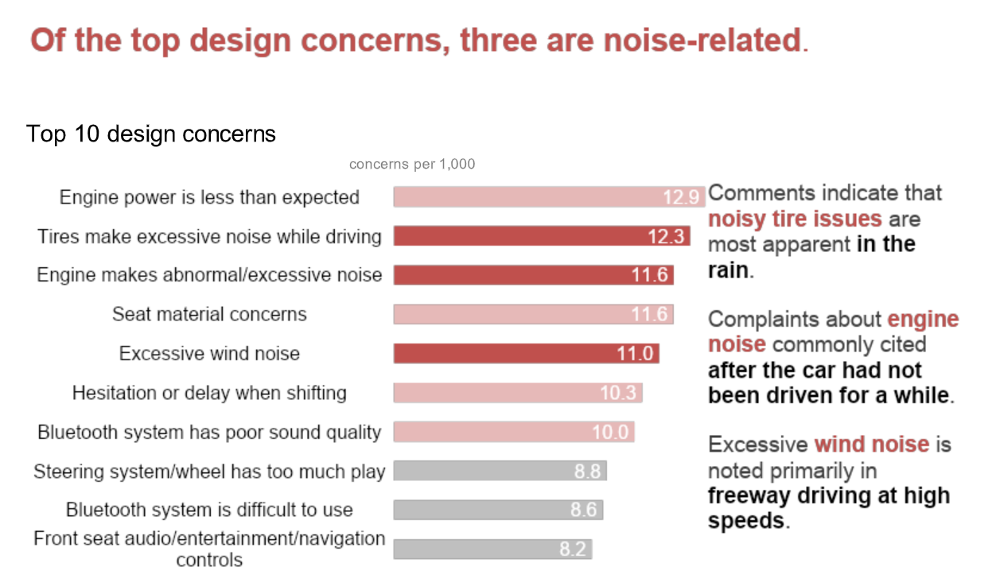

# Colors

We want to use colors to highlight the important pattern we're trying to show with our charts. In the image below your eyes will automatically be drawn to the 3 dark red bars which are the noise complaints. 

</img>

The entire point of this chart is to show the noise complaints so this use of color is effective in highlighting this pattern.

## Grays

In plots where we want to gray out bars or lines, this gray color looks nice. Plus, it's easy to remember, it's just "d3" 3 times.
<ColorDisp code="#d3d3d3"></ColorDisp>
If you have to have gray text, the above color is often too light so we can use a darker gray instead:
<ColorDisp code="#adadad"></ColorDisp>

## Categories

If you only need 1 or two colors, always use a blue because it generally looks good.

<ColorDisp code="#4e79a7"></ColorDisp>
<ColorDisp code="#f28e2c"></ColorDisp>
<ColorDisp code="#e15759"></ColorDisp>
<ColorDisp code="#76b7b2"></ColorDisp>
<ColorDisp code="#59a14f"></ColorDisp>
<ColorDisp code="#edc949"></ColorDisp>
<ColorDisp code="#af7aa1"></ColorDisp>
<ColorDisp code="#ff9da7"></ColorDisp>
<ColorDisp code="#9c755f"></ColorDisp>
<ColorDisp code="#bab0ab"></ColorDisp>

We can import the color scheme, from the 'd3-scale-chromatic' package.

```js
import { schemeTableau10 } from 'd3-scale-chromatic';

console.log(schemeTableau10) // array of hex codes for colors above ^
```

We can also setup a scale to keep track of which color goes with each category.

```js
import { scaleOrdinal } from 'd3-scale';
const colorScale = scaleOrdinal().range(schemeTableau10);

colorScale("category1") // "#4e79a7
```

Here are other nice colors to use:

<ColorDisp code="#08519C"></ColorDisp>
<ColorDisp code="#005AA3"></ColorDisp>
<ColorDisp code="#D96942"></ColorDisp>
<ColorDisp code="#EDC949"></ColorDisp>

Try to avoid using the light values such as the yellow or pink unless you have a lot of categories. Don't use a 
blue and yellow that look like UCSB colors together if the data is not from/about UCSB.

If we need to change the color for a bar/text/arrow it's very difficult to look through code and know which hex codes to change.

**Please use objects to give hex codes labels and keep in them in one place**. If you are using a blue and orange from the list above, create an object such as:

```js
const colors = {
    blue: "#4e79a7",
    red: "#f28e2c"
}
```

or category names such as:

```js
const colors = {
    undergrads: "#4e79a7",
    grads: "#f28e2c"
}
```

And then if you ever want to use that blue you can just give the value:
```js
colors.blue
```

which will make the code a lot more readable and easier to change colors in the future

## Continuous Colors

We can use continuous color scales such as the one below to emphasize the low and high values of continuous data.

</img>

The following code creates a scale to use this color scale:

```js
import { interpolateBlues } from 'd3-scale-chromatic';
import { scaleSequential } from 'd3-scale';

const colorScale = scaleSequential().interpolator(interpolateBlues);
colorScale(0) // color code
```

For more colors you can checkout [the d3 scale-chromatic docs](https://github.com/d3/d3-scale-chromatic).