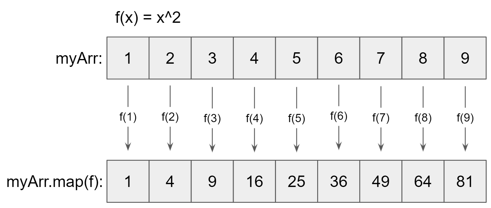
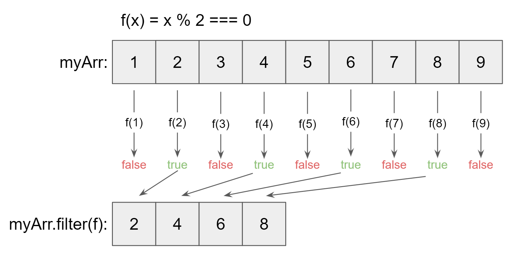

# Data Wrangling and Manipulation in JS

This guide goes over 3 major concepts:

* Array Operations
* Javascript Objects
* Wrangling in D3

## Array Operations

```js
const myArr = [1, 2, 3, 4, 5, 6, 7, 8, 9]
```

### Map

Map applies a function to each element of an array and returns a new array of the function outputs.

Use `.map()` to return an array of the squares of `myArr`.

```js
const squares = myArr.map(x => x**2);
console.log(squares); // [1, 4, 9, 16, 25, 36, 49, 64, 81]
```



We can also use more complex functions:

```js
const factorials = myArr.map((x) => {
    let prod = 1;
    for (let i = 1; i <= x; ++i) {
        prod *= i;
    }
    return prod;
});
console.log(factorials); // [1, 2, 6, 24, 120, 720, 5040, 40320, 362880]
```

The index of each element is passed in as the second item:

```js
const indices = myArr.map((x, i) => i)
console.log(indices) // [0, 1, 2, 3, 4, 5, 6, 7, 8]
```

### Filter

The filter operation returns an array of elements from the original array that meet a specified condition.

`.filter()` returns the `true` values from the elements passed through a function. The `%` is the modulus operator which returns the remainder after division. When you divide an even number by 2, there will always be a remainder of zero. Get the even numbers of `myArr` using `.filter()`.



```js
const evenNumbers = myArr.filter(x => x % 2 === 0);
console.log(evenNumbers); // [2, 4, 6, 8]
```

## Javascript Objects

Objects are key-value collections of data.

```js
const myObj = {
    name: "Labyrinth",
    nWriters: 5
};
```

We can access items by their key:

```js
console.log(myObj.name); // "Labyrinth"
```

### Object Destructuring

We can turn object values into individual variables as follows: 

```js
const { name, nWriters } = myObj;
console.log(name, nWriters) // "Labyrinth", 5
```

## Wrangling with D3

Oftentimes, our data will be arrays of objects. This array contains data for 3 students.

```js
const students = [
    { major: "Math", gpa: 3.00 },
    { major: "Compsci", gpa: 3.50 },
    { major: "Compsci", gpa: 3.75 }
]
```

### d3.max()

We can get the maximum gpa of all students:

```js
const maxGpa = d3.max(students, d => d.gpa)
console.log(maxGpa) // 3.75
```

The first argument passed into `d3.max()` must be an array of values. Then, the second argument can be a function that returns a value for each element of the array.

### d3.nest()

Often, we'll want to group data by a common value. Here, we're going to group together students with the same major using `d3.nest()`.

```js
const nestedData = d3Collection
    .nest()
    .key((d) => d.major)
    .entries(students)

console.log(nestedData)
// [
//   { 
//       key: 'Math', 
//       values: [ { major: 'Math', gpa: 3 } ],
//   },
//   { 
//       key: 'Compsci', 
//       values: [ 
//           { major: 'Compsci', gpa: 3.5 }, 
//           { major: 'Compsci', gpa: 3.75 } 
//       ] 
//   }
// ]
```

Here, we pass a function through `.key()` for the major value. This tells d3 to group the data by major. Then, we pass the entire array through by entering the array name into `.entries()`.


If we want to get the maximum GPA by major, we can map the `nestedData` array and then use `d3.max()` to get the maximum value from each major's `values` key.

```js
const maxGpaByDept = nestedData.map({ key, values }) => ({
    key,
    maxGPA: d3.max(values, (d) => d.gpa),
}));

console.log(maxGpaByDept);
// [ { key: 'Math', maxGPA: 3 }, { key: 'Compsci', maxGPA: 3.75 } ]
```